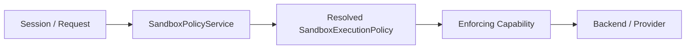
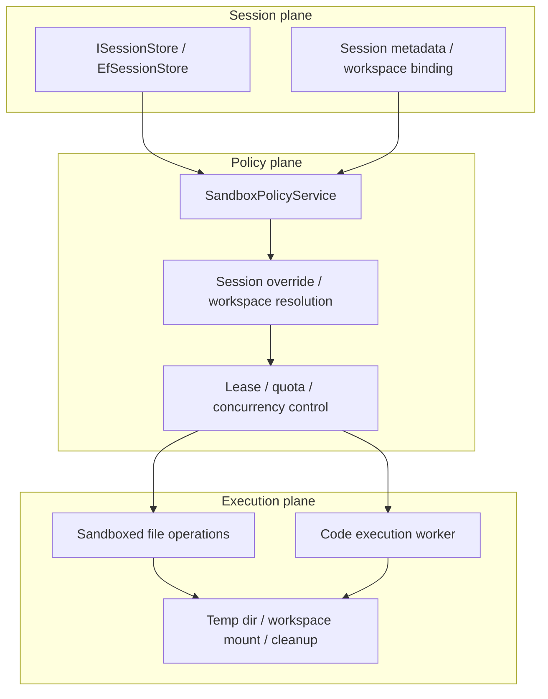
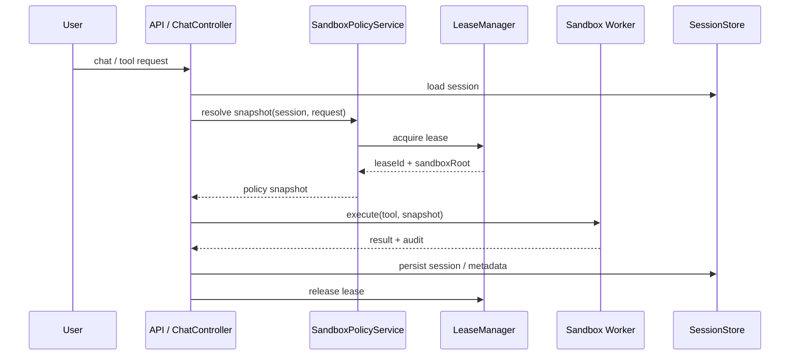

# Harness 会话与沙箱重构方案

## 1. 背景

当前 QianYuan 的会话与沙箱实现是可用的，但还停留在“技能局部约束”的阶段：

- 会话主要由 `ISessionStore` / `EfSessionStore` 承担，负责聊天记录持久化、标题、消息列表、OwnerId 等。
- 文件约束主要由 `FileSystemSkill` 在技能内部基于 `workspacePath` 与 `permission` metadata 做路径约束。
- 代码执行约束主要由 `CodeExecutionSkill` 在技能内部按 `ownerId + sessionId` 计算运行目录。
- 运行层、会话层、沙箱层之间没有统一的 policy home，也没有“每次调用先解析 policy，再交给执行层”的单一入口。

这套方式适合小规模单机使用，但面对以下场景会开始失真：

- 多用户并发共享同一服务端实例
- 同一用户多个会话同时运行
- 同一会话内多个工具并发访问文件系统与代码执行环境
- 需要对写权限、工作区根目录、临时目录和执行隔离做统一审计
- 需要把沙箱执行从 API 进程中解耦出来，扩展为可横向扩容的隔离服务

## 2. 参考 DeepSeek Harness 的关键设计

DeepSeek Harness 的核心不是某一种沙箱后端，而是下面这条控制链：



它有几个关键原则：

- 策略单点归属

  - `ctx.sandboxPolicy` 是唯一的 policy home。
  - 读取 session 状态、默认 mode、workspace root 的逻辑只在这里发生。
  - 各执行端不重复推导 session policy。

- 每次调用都携带完整 policy

  - 执行层接收的不是“半成品参数”，而是完整的 per-call policy snapshot。
  - `mode`、`workspaceRoot`、`sessionId` 等都在调用边界确定。
  - 这让执行层可以保持无状态。

- provider / backend 只做执行，不做状态归纳

  - 沙箱 provider 不持有会话语义。
  - 会话态变化通过日志/事件折叠得到。
  - 这样才能在高并发下保持一致性和可扩展性。

- 不同 capability family 共享同一 policy home

  - 文件系统、shell、终端等不同执行面，都从同一 policy home 读取调用级 policy。
  - 各家族保留自己的 enforcement dialect，但不各自维护一套 root / mode 解析逻辑。

## 3. 现状问题

### 3.1 会话与执行边界混杂

当前 `SessionState` 记录的是聊天消息和元数据，但它没有成为统一的“运行时 policy 载体”。

- [ISessionStore.cs](../src/QianYuan.Core/Memory/ISessionStore.cs) 只提供会话 CRUD。
- [ChatController.cs](../src/QianYuan.Api/Controllers/ChatController.cs) 在流式对话时生成 session，并把 workspace 信息塞进 `MemoryContext`。
- `SkillInvocationContext` 只有 `AgentId`、`SessionId`、`Metadata`，没有明确的 policy snapshot。

这会导致：

- policy 依赖散落在多个层次
- 技能必须自己理解 metadata
- 未来要扩展工作区租约、临时目录、只读/写入模式时，需要同时改多个技能

### 3.2 沙箱是技能局部逻辑，不是统一能力

当前的文件与代码执行隔离主要是技能内部实现：

- [FileSystemSkill.cs](../src/QianYuan.Skills.Builtin/FileSystem/FileSystemSkill.cs) 通过 `workspacePath` 和 `permission` 控制是否允许写入。
- [CodeExecutionSkill.cs](../src/QianYuan.Skills.Builtin/Code/CodeExecutionSkill.cs) 通过 `ownerId + sessionId` 生成执行目录。

这类实现的问题是：

- 写权限判断和目录归属不统一
- 临时目录与 workspace 根目录之间没有统一 lease 模型
- 并发调用下的目录生命周期、回收、冲突隔离缺少集中管理
- 不能自然扩展成“服务端大规模高并发沙箱隔离服务”

### 3.3 当前 session store 只适合对话，不适合控制平面

`EfSessionStore` 更像消息存储，而不是执行控制平面。

它适合保存：

- 会话标题
- 消息序列
- 作者 / OwnerId
- 元数据

而不适合直接承担：

- policy 推导
- 沙箱租约分配
- 执行排队与资源配额
- workspace root 归属管理

因此建议把“会话存储”与“会话 policy / sandbox 调度”分层。

## 4. 目标架构

### 4.1 分层原则

建议把系统拆成三个面：

- **Session plane**：保存对话、用户、工作区、历史和审计信息
- **Policy plane**：根据 session / request / default 解析每次调用的 policy
- **Execution plane**：只消费 policy snapshot，负责真正的文件和进程隔离



### 4.2 核心设计目标

- 统一 policy home

  - 每次调用都通过一个中心服务得到完整 policy。
  - 不允许技能自行拼凑 workspace root 和权限模式。

- 执行层无状态

  - FileSystem、CodeExecution、Shell / subprocess 执行层都只接收 policy snapshot。
  - 执行层不读 session store，不推导 owner 规则。

- 多租户并发隔离

  - 同一用户多个会话可以并发。
  - 同一会话多个工具调用可以并发，但目录与进程资源必须隔离。
  - 不同用户不能共享临时执行区。

- 可横向扩容

  - 执行 worker 可独立扩容。
  - API 进程只做 policy 解析、路由、审计与回收协调。

- 审计可追踪

  - 每次调用能追溯到 sessionId、ownerId、workspaceId、mode、leaseId、workerId。

## 5. 建议的数据模型

### 5.1 SessionState 的职责收敛

保留 `SessionState` 作为聊天与业务会话载体，但不要把沙箱行为直接写进技能的 metadata 约定里。

建议新增一个明确的运行时片段，例如：

- `WorkspaceId`
- `WorkspaceRoot`
- `SandboxMode`
- `ExecutionProfileId`
- `LeasePolicy`
- `ConcurrencyGroup`

如果不想新增表，也可以先放入 `SessionState.Metadata`，但要用稳定键名和统一访问层封装，而不是让技能直接读字符串。

建议的方向是：

- 聊天态继续走 `SessionState`
- 运行态单独抽 `SessionRuntimeState` 或 `SandboxSessionState`
- 该状态可由 session store 持久化，也可由专门的 policy store 持久化

### 5.2 统一 policy snapshot

建议定义一个对执行层友好的不可变对象：

- `SessionId`
- `OwnerId`
- `WorkspaceRoot`
- `Mode`
- `LeaseId`
- `SandboxRoot`
- `TempRoot`
- `WorkerHint`
- `ExpiresAt`

这份 snapshot 相当于 DeepSeek Harness 的 `SandboxExecutionPolicy` 思路，只不过在 QianYuan 中需要同时覆盖文件系统和代码执行场景。

## 6. 统一 policy service 设计

### 6.1 职责

新增一个服务，例如 `ISandboxPolicyService`，负责：

- 读取会话状态
- 结合 request / agent / owner / workspace 解析运行 policy
- 处理默认模式和显式 override
- 分配或回收 sandbox lease
- 输出完整的 execution snapshot

### 6.2 解析规则

建议优先级如下：

1. 显式调用级 override
2. session / conversation 绑定的 policy
3. deployment default
4. fail-safe 默认值

这和 DeepSeek Harness 的“explicit grant > session fold > default”一致。

### 6.3 目录和租约

建议把 sandbox 目录设计成三层：

- `sandbox-root`：服务端总根目录
- `users/{ownerId}`：租户隔离层
- `sessions/{sessionId}`：会话隔离层
- `leases/{leaseId}`：调用级临时层

例如：

```text
sandbox-root/
  users/
    alice/
      workspaces/
        ws-123/
      sessions/
        sess-abc/
          leases/
            lease-001/
            lease-002/
```

这比单纯的 `ownerId + sessionId` 更适合并发：

- session 可以有多个 lease
- 同一 lease 可以绑定一个 worker
- 失败后 lease 可独立回收
- 运行文件与工作区文件分离

## 7. 执行面改造建议

### 7.1 FileSystemSkill

当前 `FileSystemSkill` 已经能做路径 containment，但它还是技能局部逻辑。

建议改为：

- 不再直接读取 `workspacePath` / `permission` 作为主逻辑
- 改为从 `SkillInvocationContext` 中读取解析后的 `SandboxPolicySnapshot`
- 只负责按 snapshot 约束读写
- 写操作使用统一的 workspace root 和 lease temp root

理想形态：

- 读：允许在 session workspace 下读取
- 写：只允许在 workspace root 或 lease temp root 写
- 审计：记录被拒绝的 policy mode 和 target

### 7.2 CodeExecutionSkill

当前 `CodeExecutionSkill` 的 `ownerId + sessionId` 目录分层已经接近正确方向，但还不够。

建议补齐：

- 每次执行分配独立 `leaseId`
- 代码文件、stdout/stderr spill、临时产物都放入 lease 目录
- 执行完成后异步清理，失败也要做最终回收
- Worker 不直接复用 API 进程里的共享目录状态

这会使代码执行天然支持：

- 同 session 并发运行多个 snippet
- 长任务与短任务并行
- worker 崩溃后按 lease 重试或回收

### 7.3 未来的 shell / subprocess / MCP 扩展

如果后面引入更强的 shell 或 subprocess sandbox，可以直接复用同一 policy snapshot：

- 进程启动前拿到 `SandboxExecutionPolicy`
- 进程工作目录绑定到 lease directory
- 网络、文件、进程树的限制按同一 policy plane 决定

这样不会再出现每个 capability family 自己一套 root 解析的情况。

## 8. 大规模高并发隔离服务

### 8.1 控制平面与数据平面分离

建议把 API 进程里的 sandbox 逻辑拆成两类：

- **控制平面**：policy 解析、配额、排队、审计、lease 分配
- **数据平面**：真实文件读写、代码执行、临时目录操作

控制平面可以留在现有 API；数据平面建议抽成独立 worker service，后续可扩容为多实例。

### 8.2 典型调用链



### 8.3 并发控制建议

- Session 级互斥不是默认

  - 不要因为同一 session 就全局串行。
  - 应按资源类型细分：工作区写、代码执行、长期任务、外部网络请求。

- Lease 级互斥

  - 同一 workspace 同时允许多个只读调用。
  - 写调用按 workspace 或 lease 粒度加锁。
  - 长任务独占自己的 lease。

- 配额与限流

  - 每个 owner 限制同时活跃 lease 数
  - 每个 workspace 限制同时写调用数
  - 每个 worker 限制 CPU / memory / wall-clock time

- 回收机制

  - lease TTL
  - worker heartbeats
  - 崩溃后 orphan lease 扫描
  - 按 owner / session 回收孤儿目录

### 8.4 隔离目录的生命周期

建议所有可写目录遵循同一套生命周期：

- 创建：policy resolve 时分配 lease
- 使用：执行层只接收 lease path
- 结束：正常完成后清理
- 失败：进入延迟回收队列
- 超时：由 lease manager 强制回收

## 9. 建议的代码结构

可以新增这些模块：

- `src/QianYuan.Core/Sandbox/`
  - `SandboxMode.cs`
  - `SandboxPolicySnapshot.cs`
  - `ISandboxPolicyService.cs`
  - `ISandboxLeaseManager.cs`
- `src/QianYuan.Api/Services/`
  - `SessionSandboxPolicyService.cs`
  - `SandboxLeaseManager.cs`
- `src/QianYuan.Skills.Builtin/`
  - 将 FileSystem / CodeExecution 技能改为消费统一 policy snapshot

如果后续要做 worker 化：

- `src/QianYuan.Sandbox.Worker/`
  - 负责 file / code execution 的实际隔离执行
- `src/QianYuan.Api/Clients/`
  - 负责把 execution request 投递给 worker

## 10. 迁移路线

### Phase 1：不破坏现有 API 的统一 policy

- 新增统一 policy service
- `ChatController` 在创建 run 前解析 policy snapshot
- `SkillInvocationContext` 增加 policy 字段
- FileSystemSkill 和 CodeExecutionSkill 只读 policy，不再自己拼 workspace 规则

目标：先统一语义，不改部署形态。

### Phase 2：引入 lease 管理

- 为每次写入和代码执行分配 lease
- 目录按 lease 隔离
- cleanup 做成可靠回收

目标：解决并发与目录冲突。

### Phase 3：worker 化执行

- 沙箱执行搬到独立 worker
- API 只做调度、审计和会话管理
- worker 可按负载水平扩容

目标：支持大规模并发服务端隔离。

### Phase 4：统一到更多 capability family

- 后续 shell / subprocess / external tool execution 复用同一 policy snapshot
- capability family 之间不再复制 policy 逻辑

## 11. 风险与注意事项

- 不能把 session store 直接当 policy store

  - 会话持久化和执行 policy 是相关但不同的职责。
  - 建议分层，否则后面会把对话历史、工作区、租约、回收逻辑混在一起。

- 不能让技能继续自由读 metadata

  - metadata 适合作为过渡，不适合作为长期契约。
  - 一旦 policy 逻辑写入技能内部，未来 worker 化会更难。

- 目录隔离必须和清理机制绑定

  - 只做路径分层不够。
  - 没有 lease、TTL 和回收，目录最终会堆积，且在崩溃恢复时难以判断归属。

- 并发写要有明确的冲突语义

  - 同一 workspace 的多写操作要定义是互斥、乐观并发还是最后写入获胜。
  - 这需要在 policy service 层统一，而不是每个技能自己决定。

## 12. 验证建议

建议按下面顺序验证：

- 单元测试 policy resolve

  - 默认 mode
  - session override
  - 显式 override
  - workspace root canonicalization

- 单元测试 lease 分配

  - 同 owner 不同 session
  - 同 session 多 lease
  - TTL 回收

- 集成测试文件隔离

  - 同时并发写两个会话的工作区
  - 确认目录互不串写
  - 确认越界路径被拒绝

- 集成测试代码执行

  - 并发 snippet 执行
  - 每个 snippet 目录独立
  - 超时和失败后目录回收

- 压测

  - 高并发 session 创建
  - 高并发工具调用
  - worker 故障恢复

## 13. 结论

DeepSeek Harness 值得借鉴的部分，不是“一个更强的沙箱后端”，而是它把 session、workspace、mode、执行边界统一成了一个可解析、可审计、可复用的 policy 层。

QianYuan 现有系统的正确演进方向是：

- 保留 `ISessionStore` 作为会话持久化层
- 新增统一 `SandboxPolicyService` 作为 policy home
- 把 FileSystemSkill / CodeExecutionSkill 改为消费 policy snapshot
- 用 lease manager 支撑高并发、可回收、可审计的 sandbox 隔离
- 最终把真正的执行从 API 进程中拆出去，形成可横向扩容的隔离 worker 服务

这样才能从“技能级 sandbox”升级为“服务端级 sandbox isolation platform”。
